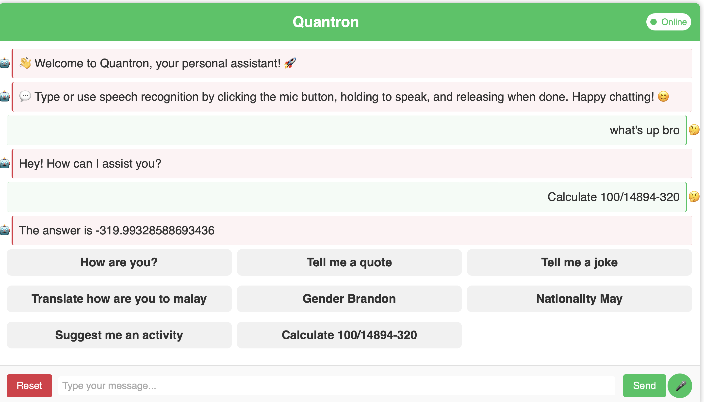

# Quantron Chatbot Web App

Welcome to Quantron, your personal assistant! Quantron is designed to chat and assist you with various tasks.

## Project Description
- A personal project developed by myself, unveiling a rudimentary web application featuring a non-AI chatbot
- Developed using a combination of Python, HTML, CSS, and JavaScript
- Comprises four organised files:
   - app.py (Backend powerhouse)
   - index.html (Frontend masterpiece)
   - styles.css (Aesthetically pleasing design)
   - script.js (Interactive wizardry)
- Displayed on the PythonAnywhere web platform

## Features
- **Type Interaction:** Simply type in the chat box and either click the "Send" button or press the enter key to communicate.
- **Speech Interaction:** Interact with Quantron naturally by clicking the mic button, holding it while speaking, and releasing it when done. 
- **Clear History:** Easily remove your chat history with the "Reset" button.
- **Clickable Prompts:** Click on the provided prompts to initiate specific actions or queries with Quantron.
- **Interactive Chat:** Engage with Quantron using specific keywords and phrases, and receive pre-scripted responses based on the recognised input. Please note that the responses are limited to the predetermined set of keywords and phrases.
- **Random Quotes:** Get random quotes from famous personalities to inspire and motivate you.
- **Random Jokes:** Enjoy a good laugh with Quantron's collection of random jokes.
- **Translation:** Translate text to different languages using the Google Translate API.
- **Gender Prediction:** Predict the gender of a given name using the Genderize API.
- **Nationality Prediction:** Predict the nationality associated with a given name using the Nationalize API.
- **Suggest Random Activity:** Suggest random activities to help you find something interesting to do.
- **Calculations:** Acquire the answers to simple arithmetic problems with ease.

## Accessing Quantron
To access Quantron, simply visit the following website: https://sheng254.pythonanywhere.com

## Usage Examples 
- 🤔: how are you?
- 🤖: Ah, I'm floating on a cloud of tranquility and contentment.
- 🤔: what can you do?
- 🤖: I can engage in conversation, provide random quotes, jokes, translations, predict gender and nationality, suggest random activities, perform calculations, and generate responses using predefined patterns. What can I help you with today?
- 🤔: suggest me an activity
- 🤖: Write a handwritten letter to somebody
- 🤔: translate im going back to Chinese (simplified)
- 🤖: The translation of 'im going back' to chinese (simplified) is: '我è¦å›å»äº†'
- 🤔: tell me a joke
- 🤖: The past, the present and the future walk into a bar. It was tense.
- 🤔: calculate 2000 + 3000 / 200 - 2
- 🤖: The answer is 2013.0
- 🤔 : I need a good quote to improve my mood
- 🤖 : The journey of a thousand miles begins with a single step. - Lao Tzu
- 🤔 : nationality jesse
- 🤖 : The predicted nationality of jesse is FI with a probability of 0.168
- 🤔 : gender hayley
- 🤖 : The predicted gender of hayley is female with a probability of 1.0
- 🤔: thank you
- 🤖: It's my pleasure! Thank you for giving me the opportunity to assist you.
- 🤔: ok wow
- 🤖: I'm sorry, but I'm having trouble making sense of your message. Could you please rephrase it or provide more information?
- 🤔: bye
- 🤖: Farewell! I'll remember this conversation fondly.

## Potential Enhancements for the Future
- Enhance the speech recognition feature for better speed, accuracy, and usability.
- Add more features and capabilities to Quantron based on user feedback.
- Ameliorate user-friendliness and interactivity by improving the overall design aesthetics.
- Integrate machine learning (ML) and deep learning (DL) algorithms to enable more precise and targeted responses.

## Contributing
Contributions are welcome! Feel free to reach out with your suggestions, bug reports, or feature requests.

## License
This project is licensed under the [MIT License](LICENSE).
